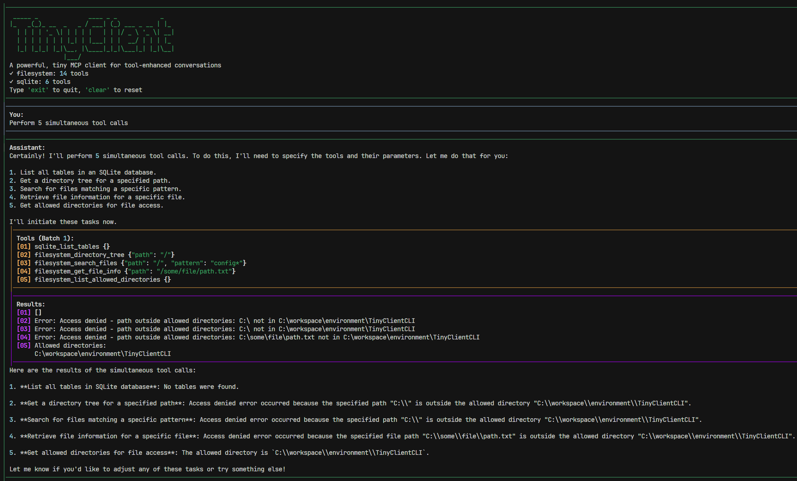

A minimal, fully featured, hackable MCP Client, all in 500 lines of code!

uv run ./main.py

Sample mcp_config.json here
{
    "mcpServers": {
        "filesystem": {
            "command": "npx",
            "args": [
              "-y",
              "@modelcontextprotocol/server-filesystem",
              "./"
            ]
        }
    }
}